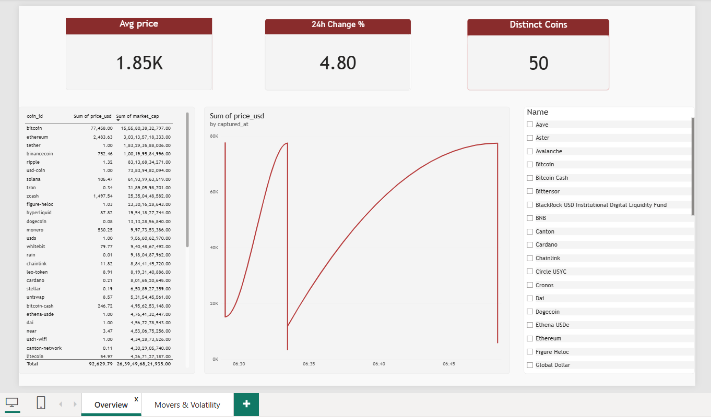

# Real-Time Crypto Market Analytics

An end-to-end analytics pipeline: live cryptocurrency market data is collected every 15 minutes by an automated job, stored in a cloud PostgreSQL database, modelled with SQL window-function views, and visualised in a Power BI dashboard with custom DAX measures.

## Architecture

```
CoinGecko public API (top 50 coins by market cap)
        |
        v
GitHub Actions  (scheduled workflow, every 15 minutes)
  runs fetch_crypto.py --once
        |
        v
Supabase PostgreSQL  (cloud database)
  tables : coins, price_snapshots
  views  : latest_prices, top_movers, price_momentum
        |
        v
Power BI  (data model, DAX measures, 2-page dashboard)
```

## Tech stack

| Layer | Tool |
|---|---|
| Ingestion | Python (`requests`, `psycopg2`) |
| Automation | GitHub Actions scheduled workflow with repository secrets |
| Storage | PostgreSQL on Supabase |
| Analysis | SQL views using `DISTINCT ON`, `RANK()`, `LAG()` |
| Reporting | Power BI Desktop, DAX |

## Data pipeline

`fetch_crypto.py` calls the CoinGecko `/coins/markets` endpoint (no API key needed) and writes one batch of 50 coin snapshots to PostgreSQL with a single UTC timestamp per batch.

- Retries with back-off when the API returns HTTP 429 (rate limit)
- Database credentials are read from environment variables, never stored in the code
- `--once` runs a single snapshot (used by the scheduled workflow); without it the script loops every 15 minutes for local use
- `migrate_to_cloud.py` is a one-time script that moved the original local SQLite history into PostgreSQL. It is safe to re-run

The scheduled job lives in `.github/workflows/collect.yml`.

## SQL layer

All views are in [`sql/views.sql`](sql/views.sql):

- **`latest_prices`**: the most recent snapshot per coin, using `DISTINCT ON`
- **`top_movers`**: coins ranked by 24h price change, using `RANK() OVER (...)`
- **`price_momentum`**: price change between consecutive snapshots, using `LAG() OVER (PARTITION BY coin_id ORDER BY captured_at)`

## DAX measures

Full list with explanations in [`dax_measures.md`](dax_measures.md).

| Measure | Purpose |
|---|---|
| Avg Price | Average price across selected coins |
| 24h Change % | Average 24-hour percentage change |
| Price Volatility | `STDEV.P` of price, the headline risk measure |
| Volatility Rank | `RANKX` ranking of coins by volatility |
| Session High / Low | Highest and lowest captured price |
| Price Range | High minus low, a simple volatility proxy |
| Distinct Coins | Number of unique coins tracked |

## Dashboard

**Page 1: Overview**: KPI cards, market-cap table, price trend line with a coin slicer.



**Page 2: Movers & Volatility**: top gainers bar chart, volatility ranking table, volume vs. volatility scatter chart.


## Run it yourself

1. Create a free PostgreSQL database (for example on Supabase).
2. Set these environment variables: `PGHOST`, `PGPORT`, `PGDATABASE`, `PGUSER`, `PGPASSWORD`.
3. Install dependencies and take a snapshot:

```
pip install -r requirements.txt
python fetch_crypto.py --once
```

4. Run `sql/views.sql` in the database, then open `crypto_analytics.pbix` in Power BI Desktop and point it at your database.

To automate collection, add the five variables above as repository secrets on GitHub. The workflow in `.github/workflows/collect.yml` does the rest.

## Repository structure

```
.github/workflows/collect.yml   scheduled collection job
fetch_crypto.py                 ingestion script
migrate_to_cloud.py             one-time SQLite to PostgreSQL migration
sql/views.sql                   analytical views
dax_measures.md                 DAX measures with explanations
crypto_analytics.pbix           Power BI report
screenshots/                    dashboard screenshots
requirements.txt
```

## What I would do next

- Publish the dashboard publicly with scheduled refresh
- Add alerts when a coin moves more than a set percentage between snapshots
- Add a third page with drill-through to a single coin
- Containerise the collector with Docker